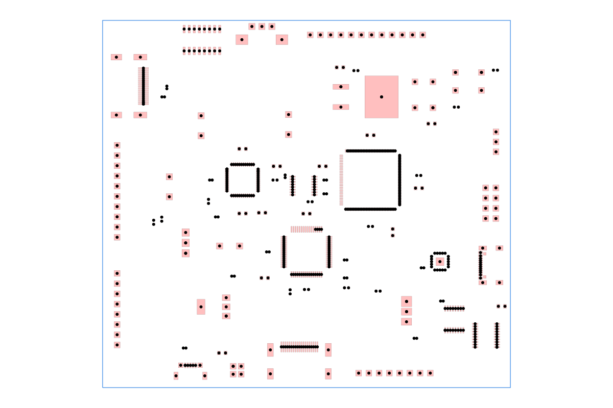

# dataset-srj13

Synthetic tscircuit dataset for connector-heavy MCU boards.

It contains 50 generated routing problems spanning HDMI, USB-C, RS232, audio,
barrel-jack, and pin-header edge connectors paired with BGA, QFN, QFP, LQFP,
and TSSOP microcontrollers plus deterministic passive placement.

## Example

The image below shows `example-24`. It is generated from the checked-in SRJ by
constructing an `AutoroutingPipelineSolver`, calling `.visualize()`, and
converting the resulting graphics object to SVG with `graphics-debug`.



Run `bun run generate:readme-image` to regenerate it. Run `bun run cosmos` to
browse the example in React Cosmos; `bun run build:site` exports the Vercel
site to `cosmos-export/`.

The source dataset is split into three phases:

1. `dataset/definitions/*.json` describes board size, edge connector kinds, MCU count, and seed.
2. `dataset/placements/*.placement.json` is generated from definitions and contains concrete component footprints, positions, bounding boxes, and trace intents.
3. `circuits/*.circuit.tsx` imports one placement JSON file and renders a tscircuit board with `routingDisabled` and `schematicDisabled`.

Run the pipeline:

```bash
bun run generate:dataset
bun run validate:placements
bun run check:examples
```

Build the distributable SRJ dataset:

```bash
bun run build:dataset-dist
```

This runs `tsci build`, converts `dist/circuits/*/circuit.json` into `dataset-dist/*.json`, and writes `dataset-dist/index.js` plus `dataset-dist/index.d.ts`. The package `main` field points at `dataset-dist/index.js`, so consumers import the generated SRJ files through the package entry point.

Use it from JavaScript or TypeScript:

```ts
import { dataset, example_01 } from "@tsci/seveibar.dataset-srj13"

console.log(dataset["example-01"])
console.log(example_01)
```

You can pin a specific commit or branch with the GitHub dependency syntax:

```json
{
  "dependencies": {
    "@tsci/seveibar.dataset-srj13": "github:tscircuit/dataset-srj13#main"
  }
}
```

Connector footprint mappings live in `scripts/generate-dataset.mjs`. HDMI, USB-C, and RS232 edge connectors are backed by `tsci import`-generated JLCPCB components in `imports/`; the other connector families use footprinter-compatible footprints plus supplier metadata.

The generator keeps MCU passives capped at each MCU's designated 2-8 count, rotates packed passives around each MCU, emits BGA/QFN/QFP/LQFP/TSSOP MCU footprints across the examples, and validates placement overlap/off-board rules before rendering.
